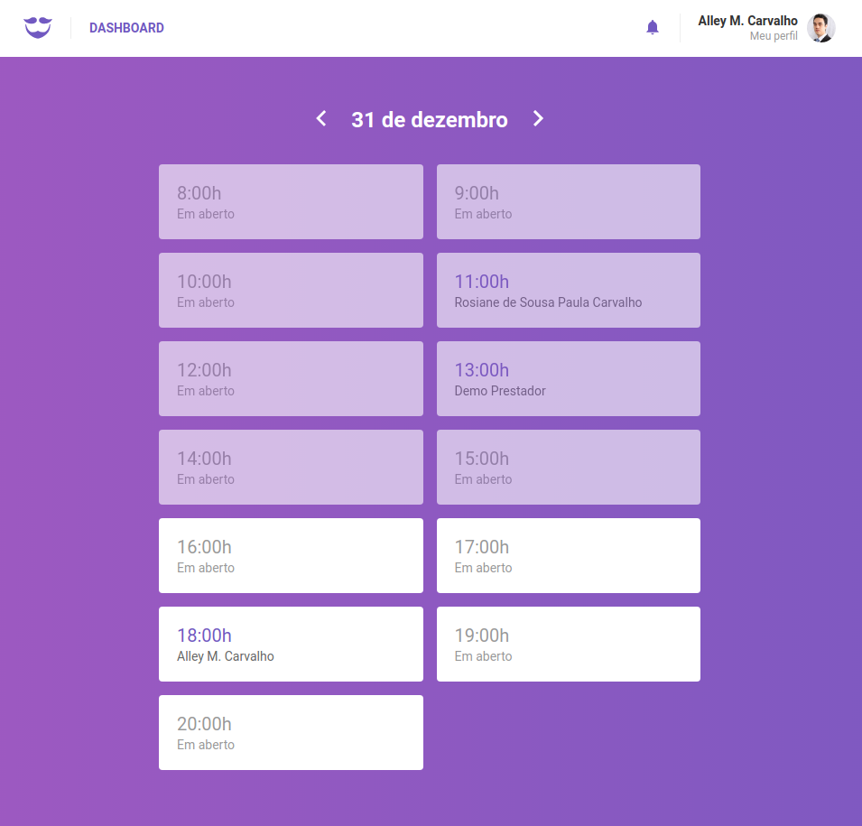
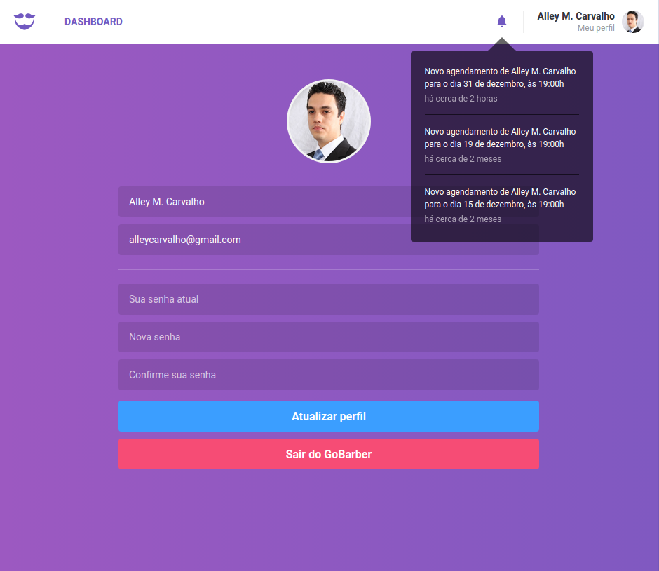

<h1 align="center">
    
</h1>

<h3 align="center">
  Desafio 9: GoBarber, frontend web
</h3>

<blockquote align="center">“Mude você e todo o resto mudará naturalmente!”</blockquote>

  

  

  

## :rocket: Sobre o projeto

- Uma aplicação para agendamentos de um salão de beleza criada do zero utilizando [react-app](https://create-react-app.dev/docs/getting-started).

## :mortar_board: Bootcamp - Desafio 9

### Ferramentas e conceitos utilizados

- [ESLint](https://eslint.org/), [Prettier](https://prettier.io/) & [EditorConfig](https://editorconfig.org/)
- [Reactotron](https://github.com/infinitered/reactotron)
- [React Router Dom](https://reacttraining.com/react-router/web/guides/quick-start)
- [Style Components](https://www.styled-components.com/docs/basics)
- [React Icons](https://react-icons.netlify.com/#/)
- Utilização do [Axios](https://github.com/axios/axios)
- [Polished](https://github.com/styled-components/polished)
- [Redux](https://redux.js.org/), [Redux Saga](https://github.com/redux-saga/redux-saga), [Immer](https://github.com/immerjs/immer) e utilização com [Reactotron](https://github.com/infinitered/reactotron)
- [History](https://github.com/ReactTraining/history/blob/master/docs/GettingStarted.md)
- [Toastify](https://github.com/fkhadra/react-toastify)
- [React Hooks](https://pt-br.reactjs.org/docs/hooks-intro.html)

### Funcionalidades

- Listar agendamentos do provedor de serviço;
- Navegação entre datas e horários disponíveis;
- Visualizar notificações;
- Marcar notificações como lidas;
- Visualizar e alterar perfil do usuário;
- Alterar avatar do usuário.

## :computer: Resultado do desafio

### Dashboard (Agendamentos)

### Notificações e Perfil do Usuário

## :memo: Licença

Esse projeto está sob a licença MIT. Veja o arquivo [LICENSE](LICENSE.md) para mais detalhes.

---

Desafio realizado por Alley M. Carvalho
